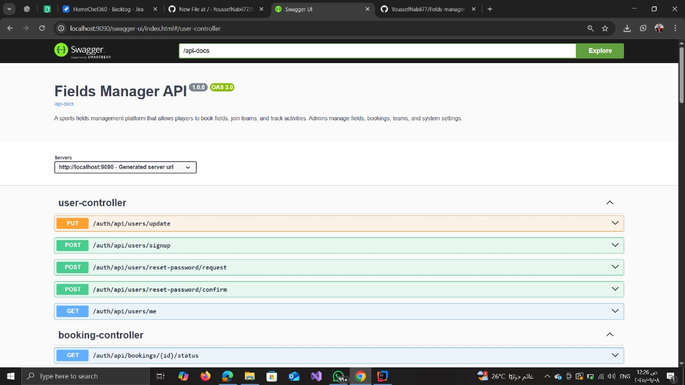

# Fields Manager – Sports Fields Management Platform  

## Overview  
Fields Manager is a **web-based platform** that connects players, teams, and administrators to simplify the process of managing sports fields.  
Players can create teams, book fields, track their bookings, and submit reviews, while admins manage fields, availability, bookings, and platform settings.  


## Features  

### Players (Users)  
- Sign up / Sign in / Logout  
- Reset & update password  
- Update profile  
- Submit enquiries  
- Create, join, and leave teams  
- Browse fields with filtering by available times  
- View field details & slots  
- Team leaders can book fields for matches  
- Track booking status  
- Rate & review bookings  
- View booking history  

### Admins  
- Sign in / Logout / Reset password / Update profile  
- Activate / deactivate players  
- Manage teams (approve, deactivate)  
- Full CRUD on fields  
- Set available timeslots for fields (weekday, time, price)  
- Approve, reject, or update bookings (reschedule, cancel, move field)  
- View booking history (with filters by date, field, team)  
- Manage ratings & reviews (delete or hide inappropriate content)  
- Manage enquiries (view / hide)  
- Update platform settings (logo, about, contact info, T&Cs) with preview  


## Core Entities  

- User: players & admins  
- Team and TeamPlayers 
- Field and FieldSlots (with weekday enum)  
- Booking and BookingStatusChange
- Review  
- Enquiry 
- Setting (platform details)  


## Tech Stack  
- Backend: Java, Spring Boot  
- Database: MySQL, JPA/Hibernate  
- Security: JWT Authentication & Authorization  
- API Documentation: Swagger / Springdoc OpenAPI  
- **IDE: IntelliJ IDEA  


## How to Run  

1. Clone the repository:  
   ```bash
   git clone https://github.com/YoussefNabil77/fields-manager-backend.git
   cd fields-manager-backend
2.Configure the database in application.properties
  spring.application.name=fields-manager-backend
  spring.datasource.url=jdbc:mysql://localhost:3306/field_manager?useSSL=false&serverTimezone=UTC
  spring.datasource.username=your_username
  spring.datasource.password=your_password
  spring.jpa.hibernate.ddl-auto=update

3.Run the project (via IntelliJ IDEA or command line)
  mvn spring-boot:run
  http://localhost:9090/swagger-ui.html

  ## Screenshots 

  Swagger UI
  

  Database Schema
  


